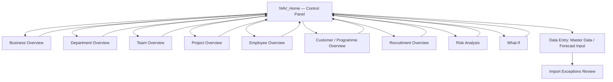

# YASA Enterprise Resource Forecasting & Capacity Planning System
## Solution Architecture Document — v0.1 (Draft for Review)

**Status:** DRAFT — pending approval. No workbook build has started.
**Author:** Claude (Solution Architect)
**Date:** 2026-08-05

---

## 1. Executive Summary

YASA needs a single source of truth for engineering resource forecasting and capacity
planning that can answer bottleneck, staffing, recruitment and what-if questions across
hundreds of employees and projects, over multi-year horizons, for Leadership, Engineering,
PMO, Finance and HR.

Excel 365 is the **delivery vehicle**, not the **architecture**. The system is designed as
a proper dimensional data model (star schema) hosted in the Excel Data Model (Power Pivot),
fed by Power Query, exposed through PivotTables/dynamic arrays, and consumed via a set of
governed dashboards. Every number on every dashboard traces back to a table row — nothing
is hard-coded, nothing is calculated twice.

Critically, the data model is built **source-agnostic and platform-agnostic**: surrogate
keys, a dimensional (star) schema, a staging layer ahead of every import, and a documented
measure catalogue mean the same shapes can be lifted into SQL Server, Microsoft Fabric,
Dataverse or Power BI later with no redesign — only a change of where the tables physically
live.

The system supports three forecasting maturity levels (Team → Employee → Skill) on one
architecture, unlimited scenarios, source-tagged demand (why capacity is consumed), and a
what-if layer that adjusts scenarios without duplicating base data. It is explicitly
designed to be legible to a future AI/Copilot layer: consistent naming, a measure catalogue,
and data-driven what-if parameters that an assistant could read and write.

This document is Deliverable 1. **No build work begins until this architecture is
reviewed and approved.** Section 17 is a self-critique — weaknesses, scale risks and
simplifications — so those trade-offs are visible before they're baked into a workbook.

---

## 2. Workbook Architecture

Six logical layers, physically separated into distinct, colour-coded, prefixed tabs.
No layer reaches backward across another (e.g. a dashboard never reads Config directly —
it reads the Data Model, which reads Config).

```
┌─────────────────────────────────────────────────────────────────────┐
│ 6. PRESENTATION LAYER  — DSH_ dashboards, OUT_ exports, NAV_ home    │
│    PivotTables/PivotCharts + dynamic arrays bound to the Data Model  │
├─────────────────────────────────────────────────────────────────────┤
│ 5. CALCULATION LAYER  — DAX measures in Power Pivot (hidden)         │
│    Every KPI is one governed DAX measure, documented in a catalogue │
├─────────────────────────────────────────────────────────────────────┤
│ 4. DATA MODEL LAYER  — Power Pivot star schema, relationships        │
│    dim_* / fact_* / brg_* tables loaded "To Data Model"             │
├─────────────────────────────────────────────────────────────────────┤
│ 3. INPUT / MASTER DATA LAYER — MST_ and INP_ structured tables       │
│    Human-entered: employees, projects, forecast allocations, etc.   │
├─────────────────────────────────────────────────────────────────────┤
│ 2. IMPORT / STAGING LAYER  — IMP_ Power Query staging queries        │
│    Timesheets, HR extracts, recruitment ATS — landed, cleaned,      │
│    conformed to master-data keys, exceptions routed for review      │
├─────────────────────────────────────────────────────────────────────┤
│ 1. CONFIGURATION LAYER  — CFG_ tables and named ranges               │
│    Probability weights, calendars, thresholds, scenario list,       │
│    forecast-source list, RAG rules — everything a report should     │
│    never hard-code                                                  │
└─────────────────────────────────────────────────────────────────────┘
```

Design rules enforced throughout:
- Every table has a surrogate integer/GUID primary key. Names are never keys.
- Every input cell lives in a structured Table (`ListObject`), never a bare range.
- Every dashboard number is a DAX measure or a formula that references a measure/table —
  never a literal.
- No merged cells anywhere (breaks Tables, Power Query, screen readers, and sorting).
- Calculation sheets are hidden, not deleted — auditable, not invisible.

---

## 3. Entity Relationship Diagram (ERD)

```mermaid
erDiagram
    dim_BusinessUnit ||--o{ dim_Department : contains
    dim_Department   ||--o{ dim_Team : contains
    dim_Team         ||--o{ dim_Employee : "has members"
    dim_Location      ||--o{ dim_Employee : "based at"
    dim_WorkingCalendar ||--o{ dim_Employee : "working pattern"
    dim_EmploymentType ||--o{ dim_Employee : classifies
    dim_Grade        ||--o{ dim_Employee : grades
    dim_Role         ||--o{ dim_Employee : "job role"

    dim_SkillCategory ||--o{ dim_Skill : categorises
    dim_Employee     ||--o{ brg_EmployeeSkill : possesses
    dim_Skill        ||--o{ brg_EmployeeSkill : "assigned via"

    dim_Customer     ||--o{ dim_Programme : sponsors
    dim_Customer     ||--o{ dim_Project : "direct customer"
    dim_Programme    ||--o{ dim_Project : contains
    dim_ProjectStatus ||--o{ dim_Project : classifies
    dim_Priority     ||--o{ dim_Project : ranks
    dim_BusinessUnit ||--o{ dim_Project : owns
    dim_Employee     ||--o{ dim_Project : "manages (PM)"
    dim_CostCentre   ||--o{ dim_Project : "charged to"

    dim_Project      ||--o{ fact_ForecastAllocation : generates
    dim_Employee     ||--o{ fact_ForecastAllocation : "allocated to (optional)"
    dim_Team         ||--o{ fact_ForecastAllocation : "allocated to (optional)"
    dim_Skill        ||--o{ fact_ForecastAllocation : "allocated to (optional)"
    dim_Contractor   ||--o{ fact_ForecastAllocation : "allocated to (optional)"
    dim_ForecastSource ||--o{ fact_ForecastAllocation : explains
    dim_Scenario     ||--o{ fact_ForecastAllocation : versions
    dim_ResourceType ||--o{ fact_ForecastAllocation : typifies
    dim_Calendar     ||--o{ fact_ForecastAllocation : "time bucket"

    dim_Scenario     ||--o{ fact_ScenarioAdjustment : versions
    dim_Project      ||--o{ fact_ScenarioAdjustment : "adjusts (optional)"
    dim_Team         ||--o{ fact_ScenarioAdjustment : "adjusts (optional)"

    dim_Employee     ||--o{ fact_ActualAllocation : logs
    dim_Project      ||--o{ fact_ActualAllocation : "charged to"
    dim_ForecastSource ||--o{ fact_ActualAllocation : explains
    dim_Calendar     ||--o{ fact_ActualAllocation : "time bucket"
    dim_ImportBatch  ||--o{ fact_ActualAllocation : "sourced from"

    dim_Team         ||--o{ fact_Capacity : "capacity for"
    dim_Calendar     ||--o{ fact_Capacity : "time bucket"
    dim_Scenario     ||--o{ fact_Capacity : versions

    dim_Team         ||--o{ fact_Recruitment : requisitions
    dim_Role         ||--o{ fact_Recruitment : "role sought"
    dim_RecruitmentStatus ||--o{ fact_Recruitment : status

    dim_CostCentre   ||--o{ fact_Budget : "cost owner"
    dim_Calendar     ||--o{ fact_Budget : "time bucket"
    dim_Scenario     ||--o{ fact_Budget : versions

    dim_Location     ||--o{ dim_PublicHoliday : observes
```

Core dimensional model (surrogate keys implied on every table as `<Entity>ID`):



Note: `dim_Employee.ManagerEmployeeID` is a self-referencing FK (a manager is an
employee); Mermaid can't render a clean self-relationship, so it's called out here rather
than forced into the diagram.

`fact_ForecastAllocation` is deliberately **polymorphic on demand mode** — `EmployeeID`,
`TeamID` and `SkillID` are all nullable FKs, and exactly one is populated per row depending
on whether that row was entered in Team, Employee or Skill planning mode (see §7). This is
what lets all three modes share one fact table and one reporting layer.

---

## 4. Workbook Structure

Tabs are prefixed by layer and colour-coded. Suggested tab list (build order roughly
matches §16 phases):

| Prefix | Colour | Purpose | Example tabs |
|---|---|---|---|
| `NAV_` | Dark Grey | Navigation / home | `NAV_Home` |
| `CFG_` | Grey | Configuration, thresholds, lookups | `CFG_ProbabilityWeights`, `CFG_RAGThresholds`, `CFG_Scenarios`, `CFG_ForecastSources`, `CFG_Settings` |
| `IMP_` | Blue | Power Query staging landing zones (mostly hidden, Data-Model-only) | `IMP_TimesheetStaging`, `IMP_HRStaging`, `IMP_RecruitmentStaging`, `IMP_Exceptions` |
| `MST_` | Green | Master data entry | `MST_Employees`, `MST_Teams`, `MST_Departments`, `MST_Skills`, `MST_EmployeeSkills`, `MST_Projects`, `MST_Programmes`, `MST_Customers`, `MST_Contractors`, `MST_Locations`, `MST_CostCentres`, `MST_Calendar` |
| `INP_` | Yellow | Transactional / forecast input | `INP_ForecastAllocations`, `INP_Capacity`, `INP_Recruitment`, `INP_Budget`, `INP_ScenarioAdjustments` |
| *(hidden)* | Black | Data Model relationships & DAX measures live in Power Pivot, not on a worksheet | — |
| `DSH_` | Purple | Dashboards | `DSH_BusinessOverview`, `DSH_DepartmentOverview`, `DSH_TeamOverview`, `DSH_ProjectOverview`, `DSH_EmployeeOverview`, `DSH_CustomerOverview`, `DSH_ProgrammeOverview`, `DSH_RecruitmentOverview`, `DSH_RiskAnalysis`, `DSH_WhatIf` |
| `OUT_` | Orange | Exports / print packs / exceptions review | `OUT_ExecutivePack`, `OUT_ImportExceptions` |

All `MST_` and `INP_` sheets are genuine structured Excel Tables loaded to the Data Model.
`IMP_` sheets are Power Query outputs — most load as **Connection Only → Data Model**, not
to a worksheet, to keep the file light (see §12).

---

## 5. Table Definitions

Primary keys are bold. All keys are integers (or GUID for high-volume fact rows) —
never a name or code.

### 5.1 Master / Dimension Tables

**dim_BusinessUnit** — **BusinessUnitID**, BusinessUnitName, Notes

**dim_Department** — **DepartmentID**, DepartmentName, BusinessUnitID (FK), Notes

**dim_Team** — **TeamID**, TeamName, DepartmentID (FK), ManagerEmployeeID (FK →
dim_Employee), BudgetedHeadcount, Notes

**dim_Employee** — **EmployeeID**, EmployeeName, ManagerEmployeeID (FK, self), DepartmentID
(FK), TeamID (FK), RoleID (FK), GradeID (FK), EmploymentTypeID (FK), LocationID (FK),
WorkingCalendarID (FK), ContractHoursPerWeek, StandardWeeklyHours, FTE, CostRate,
ChargeRate, EmploymentStartDate, EmploymentEndDate, StatusID (FK → dim_EmployeeStatus),
HolidayAllowanceDays, TrainingAllowanceDays, UtilisationTargetPct, Notes,
CreatedDate, ModifiedDate

**dim_Role** — **RoleID**, RoleName, DisciplineCategory

**dim_Grade** — **GradeID**, GradeName, GradeLevel (sort order)

**dim_EmploymentType** — **EmploymentTypeID**, TypeName (Permanent, Fixed Term,
Contractor, Agency, Graduate, Apprentice)

**dim_EmployeeStatus** — **StatusID**, StatusName (Active, On Leave, Leaver, Future
Starter)

**dim_Location** — **LocationID**, LocationName, Country, RegionCode,
WorkingCalendarID (FK, default calendar for the site)

**dim_WorkingCalendar** — **CalendarID**, CalendarName, StandardWeeklyHours,
CountryCode

**dim_PublicHoliday** — **HolidayID**, LocationID (FK), HolidayDate, HolidayName

**dim_Calendar** (date dimension) — **DateKey** (yyyymmdd int), Date, DayName,
WeekNumber, WeekStartDate, MonthNumber, MonthName, Quarter, FiscalYear, FiscalPeriod,
IsWorkingDay, IsPublicHoliday

**dim_SkillCategory** — **SkillCategoryID**, CategoryName (e.g. Mechanical,
Electrical/Power Electronics, Software, Quality, Programme)

**dim_Skill** — **SkillID**, SkillName, SkillCategoryID (FK), IsCriticalSkill (flag
used by risk analysis)

**brg_EmployeeSkill** (many-to-many bridge) — **EmployeeSkillID**, EmployeeID (FK),
SkillID (FK), CompetencyLevel (1–5), YearsExperience, Approved (bool), LastValidatedDate,
IsPrimarySkill, IsSecondarySkill, IsFutureSkill

**dim_Customer** — **CustomerID**, CustomerName, CustomerAccountManagerEmployeeID (FK),
Notes

**dim_Programme** — **ProgrammeID**, ProgrammeName, CustomerID (FK), ProgrammeManagerEmployeeID
(FK), Notes

**dim_ProjectStatus** — **ProjectStatusID**, StatusName (Prospect, RFQ, Preferred,
Committed, Won, Cancelled), DefaultProbabilityPct (editable, drives §8 weighting), SortOrder

**dim_Priority** — **PriorityID**, PriorityName (e.g. Critical/High/Medium/Low), SortOrder

**dim_Project** — **ProjectID**, ProjectName, CustomerID (FK), ProgrammeID (FK, nullable),
ProjectManagerEmployeeID (FK), BusinessUnitID (FK), PriorityID (FK), ProjectStatusID (FK),
LifecyclePhase, ProbabilityOverridePct (nullable — overrides the status default),
StartDate, FinishDate, RevenueForecast, BudgetCost, TargetMarginPct,
StrategicImportanceFlag, RAGStatus, Gateway, Technology, Platform, CostCentreID (FK), Notes

**dim_ResourceType** — **ResourceTypeID**, TypeName (Employee, Contractor, Agency,
Graduate)

**dim_Contractor** — **ContractorID**, ContractorName, AgencyName, RoleID (FK),
CostRate, ContractStartDate, ContractEndDate, TeamID (FK)

**dim_CostCentre** — **CostCentreID**, CostCentreCode, CostCentreName, DepartmentID (FK)

**dim_Scenario** — **ScenarioID**, ScenarioName (Budget, Baseline, Current Forecast,
Latest Forecast, Scenario A/B/C…), IsActive, IsLocked, CreatedDate, BaseScenarioID
(nullable FK, self — lets a scenario be defined as "a copy of Baseline plus adjustments")

**dim_ForecastSource** — **ForecastSourceID**, SourceName (Project, Business
Development, RFQ, BAU, Continuous Improvement, Innovation, Training, Management, Quality,
Customer Support, Annual Leave, Sickness, Internal Projects), IsProjectLinked (bool)

**dim_RecruitmentStatus** — **RecruitmentStatusID**, StatusName (Vacancy Approved,
Recruiting, Interviewing, Offer Made, Offer Accepted, Cancelled, Started), SortOrder

**dim_ImportBatch** — **ImportBatchID**, SourceSystem, SourceFileName, RefreshTimestamp,
RowCount, ExceptionCount

**ref_MeasureCatalog** *(AI-readiness / documentation table, not user-facing)* —
**MeasureID**, MeasureName, MeasureGroup, PlainEnglishDescription, DAXExpression,
BusinessQuestionTags — see §17 and the AI Decision Support note in §3/§15.

### 5.2 Transactional / Fact Tables

**fact_ForecastAllocation** — **AllocationID**, ScenarioID (FK), ProjectID (FK, nullable
— non-project sources like BAU/Training/Leave may be team- or employee-level only),
EmployeeID (FK, nullable), TeamID (FK, nullable), SkillID (FK, nullable), ContractorID (FK,
nullable), ResourceTypeID (FK), ForecastSourceID (FK), DateKey (FK, week-commencing bucket),
Hours, FTE (derived, but stored for import symmetry — see §17 on this trade-off), Notes

**fact_ActualAllocation** — **ActualID**, EmployeeID (FK), ProjectID (FK, nullable),
ForecastSourceID (FK), DateKey (FK), ActualHours, ImportBatchID (FK)

**fact_Capacity** — **CapacityID**, TeamID (FK), ScenarioID (FK), DateKey (FK, month
bucket), BudgetedHeadcount, ActualHeadcount, Vacancies, ContractorsCount, AgencyCount,
GraduateIntakeCount, FutureHiresCount, LeaversCount, StandardHours, TrainingHours,
BusinessShutdownHours, HolidayHours, InternalMeetingHours, BAUAllowanceHours,
ManagementOverheadHours *(AvailableHours, AvailableFTE, AvailableCost are DAX measures,
not stored — see §17)*

**fact_Recruitment** — **RequisitionID**, TeamID (FK), RoleID (FK),
RecruitmentStatusID (FK), ApprovedDate, TargetStartDate, ActualStartDate,
CancelledDate, Notes

**fact_Budget** — **BudgetID**, CostCentreID (FK), ScenarioID (FK), DateKey (FK, month
bucket), BudgetAmount, CostCategory (Direct Labour, Indirect Labour, Contractor, Agency,
Capitalised Engineering)

**fact_ScenarioAdjustment** *(the what-if engine — see §7.4)* — **AdjustmentID**,
ScenarioID (FK), AdjustmentTypeID (FK → dim_AdjustmentType: Delay, Cancel, Win, Recruitment
Freeze, New Hire, Contractor Loss, Team Expansion, Team Reduction), ProjectID (FK,
nullable), TeamID (FK, nullable), DeltaWeeks (nullable), EffectiveDateKey, Notes,
CreatedBy, CreatedDate

### 5.3 Staging Tables (Power Query, per §8)

`stg_TimesheetRaw`, `stg_HREmployeeRaw`, `stg_RecruitmentRaw` — one per source, shaped to
mirror the target fact/dimension exactly, with an `_ImportBatchID` and `_ExceptionReason`
column so bad rows are visible, not silently dropped.

---

## 6. Relationships Between Tables

| From | To | Cardinality | Key |
|---|---|---|---|
| dim_BusinessUnit | dim_Department | 1:N | BusinessUnitID |
| dim_Department | dim_Team | 1:N | DepartmentID |
| dim_Team | dim_Employee | 1:N | TeamID |
| dim_Employee | dim_Employee (self) | 1:N | ManagerEmployeeID |
| dim_Location | dim_Employee | 1:N | LocationID |
| dim_Employee | brg_EmployeeSkill | 1:N | EmployeeID |
| dim_Skill | brg_EmployeeSkill | 1:N | SkillID |
| dim_Customer | dim_Programme | 1:N | CustomerID |
| dim_Programme | dim_Project | 1:N | ProgrammeID |
| dim_ProjectStatus | dim_Project | 1:N | ProjectStatusID |
| dim_Project | fact_ForecastAllocation | 1:N | ProjectID |
| dim_Employee | fact_ForecastAllocation | 1:N (optional) | EmployeeID |
| dim_Team | fact_ForecastAllocation | 1:N (optional) | TeamID |
| dim_Skill | fact_ForecastAllocation | 1:N (optional) | SkillID |
| dim_Scenario | fact_ForecastAllocation | 1:N | ScenarioID |
| dim_Calendar | fact_ForecastAllocation | 1:N | DateKey |
| dim_Employee | fact_ActualAllocation | 1:N | EmployeeID |
| dim_ImportBatch | fact_ActualAllocation | 1:N | ImportBatchID |
| dim_Team | fact_Capacity | 1:N | TeamID |
| dim_Team | fact_Recruitment | 1:N | TeamID |
| dim_CostCentre | fact_Budget | 1:N | CostCentreID |
| dim_Scenario | fact_ScenarioAdjustment | 1:N | ScenarioID |

All relationships are single-direction filter, one-to-many, built in Power Pivot's
Diagram View — never simulated with `VLOOKUP`/`XLOOKUP` chains on the model tables. Lookup
formulas are reserved for validation dropdowns and worksheet convenience only.

`dim_Calendar` is the single shared date table — every fact table relates to it, which is
what makes "view by Week / Month / Quarter / Year" a single slicer rather than five
separate builds.

---

## 7. Calculation Logic

All KPIs are DAX measures in the Data Model, grouped and documented in
`ref_MeasureCatalog`. No dashboard contains an ad hoc formula that duplicates a measure's
logic — dashboards only ever reference the measure.

### 7.1 Demand & Probability
- `Committed Demand` = SUM of Hours where `ProjectStatus.StatusName` ∈ {Committed, Won}
- `Weighted Demand` = SUMX over allocations of `Hours × EffectiveProbability%`, where
  `EffectiveProbability% = COALESCE(Project.ProbabilityOverridePct, Status.DefaultProbabilityPct)`
- `Stretch Demand` = SUM of Hours across all non-cancelled statuses, unweighted

### 7.2 Capacity & Utilisation
- `Available Hours` = StandardHours − (Training + Shutdown + Holiday + InternalMeeting +
  BAUAllowance + ManagementOverhead), from `fact_Capacity`
- `Available FTE` = `Available Hours` ÷ (StandardWeeklyHours × working weeks in period)
- `Booked Hours` = SUM(`fact_ForecastAllocation[Hours]`) for the selected scenario
- `Utilisation %` = `Booked Hours` ÷ `Available Hours`
- `Headroom` = `Available Hours` − `Booked Hours`
- `Over Allocation` / `Under Allocation` = conditional splits of `Headroom` against
  `CFG_RAGThresholds`

### 7.3 Financial
- `Engineering Cost` = SUMX(`fact_ForecastAllocation`, `Hours × RELATED(Employee[CostRate])`)
  (Employee mode) or a blended rate for Team/Skill mode, held in `CFG_Settings`
- `Cost per Team / Project / Programme / Department` = the above sliced by the relevant
  dimension (no separate formula per slice — one measure, different filter context)
- `Revenue per FTE` = `SUM(Project[RevenueForecast])` ÷ `SUM(Employee[FTE])` in context

### 7.4 Scenarios & What-If (dynamic-array driven)
Scenarios are **not** duplicated copies of the allocation table. `dim_Scenario` lets a
scenario be defined as "Baseline + adjustments." A DAX measure resolves the effective
allocation by applying any matching rows in `fact_ScenarioAdjustment` to the base data at
query time (e.g. a Delay adjustment shifts `DateKey` by `DeltaWeeks`; a Cancel adjustment
zeroes out matching rows; a New Hire/Team Expansion adjustment adds capacity rows). This
means "what happens if Project X slips 8 weeks" is a single row insert into
`fact_ScenarioAdjustment` — every dashboard recalculates automatically because they all
read through the same measures.

Excel's native **What-If Analysis** parameter tables back the `DSH_WhatIf` sheet sliders
(e.g. "Delay by N weeks"), writing into `fact_ScenarioAdjustment` on confirm.

### 7.5 Risk
- `Teams Over 100%` = COUNTROWS of teams where `Utilisation %` > 100%
- `Critical Skill Shortage` = flag where `SUM(EmployeeSkill[Approved])` for a
  `IsCriticalSkill` skill < demand implied by skill-mode allocations
- `Single Point of Failure` = skills where COUNT of approved, primary-skill employees = 1
- `Projects With No Resource` = projects with zero rows in `fact_ForecastAllocation`

### 7.6 Dynamic Arrays
Used specifically where a PivotTable is the wrong tool: dependent/cascading validation
lists (`UNIQUE`/`SORT`/`FILTER` off master tables), the Manhattan/heat-map grid layouts
(`FILTER` + spill instead of hand-built SUMIFS grids), and the `DSH_WhatIf` scenario
comparison grid (spilled array recalculating live as parameters change).

---

## 8. Import Strategy

Every external feed lands through the same four-stage pipeline:

1. **Landing** — Power Query reads a folder (e.g. `/Imports/Timesheets/*.csv`) via
   `Folder.Files`, so the user's workflow really is "drop the export, click Refresh."
2. **Staging** (`stg_*`) — raw columns renamed/typed, but **not yet matched** to master
   keys.
3. **Conforming** — merge against `dim_Employee` (by Employee Number, not name),
   `dim_Project` (by Project Code), etc. Rows that fail to match are **not dropped** — they
   route to `stg_*_Exceptions` and surface on `OUT_ImportExceptions` for someone to fix
   (usually a missing master-data entry) and re-refresh.
4. **Load** — matched rows append to the relevant fact table (`fact_ActualAllocation`,
   etc.), tagged with a new `dim_ImportBatch` row for auditability (who/when/how many rows,
   supports the "Actual vs Forecast" trend measures in §7 without any manual reconciliation
   step).

Feeds planned for Phase 5+ (import sources are added, not redesigned, as new systems
connect — see §15): Timesheet exports, HR master extract, Recruitment/ATS extract. Each
gets its own `stg_` query but lands in the same conformed fact/dimension shapes, which is
the point of the staging layer — the workbook doesn't care whether the timesheet file
came from Excel export, SAP, or (later) a Fabric pipeline.

All staging and conforming queries load **Connection Only → Add to Data Model**, never to
a worksheet, to keep row-heavy imports off the grid (see §12).

---

## 9. Dashboard Wireframes

Common frame on every `DSH_` sheet: a slicer panel (left, ~15% width, synced across all
dashboards via Slicer report connections) + KPI card row (top) + chart zone (body). No
dashboard hand-builds its own filter logic — all slicers filter the same Data Model.

```
DSH_BusinessOverview
┌───────────────┬───────────────────────────────────────────────────┐
│ FILTERS        │  [FTE Booked] [Utilisation %] [Headroom] [Cost YTD]│
│ • Scenario     │  [Weighted Demand] [Recruitment Req'd] [Risk Count]│
│ • Business Unit├───────────────────────────────────────────────────┤
│ • Department   │  Manhattan Chart: Demand vs Capacity by Month      │
│ • Team         │                                                     │
│ • Date/Timeline│  Heat Map: Utilisation % by Department x Month     │
│ • Status       ├───────────────────────────────────────────────────┤
│ • Skill        │  Waterfall: Demand bridge (Committed→Weighted→     │
│                │  Stretch)         │  Top Risks list                │
└───────────────┴───────────────────────────────────────────────────┘
```

The remaining dashboards reuse this frame with a different chart mix:

- **DepartmentOverview / TeamOverview** — Utilisation trend line, resource histogram,
  headcount vs vacancy vs recruitment pipeline bar
- **ProjectOverview** — Project staffing chart (booked vs required by week), burn-up/
  burn-down, RAG-coloured project list
- **EmployeeOverview** — individual booked-hours calendar heat map, skill profile,
  utilisation vs target
- **CustomerOverview / ProgrammeOverview** — revenue/cost roll-up, weighted demand by
  programme, margin trend
- **RecruitmentOverview** — funnel chart by `dim_RecruitmentStatus`, future-capacity
  impact line
- **RiskAnalysis** — the §7.5 flags as a filtered, conditionally-formatted table, plus
  skill heat map (competency coverage x category)
- **WhatIf** — parameter controls (native What-If Analysis) + before/after comparison
  grid built on dynamic arrays

---

## 10. User Navigation Flow



`NAV_Home` carries the scenario selector as a single global slicer/cell, plus large
hyperlinked cards to each dashboard (no VBA — plain `HYPERLINK()` to sheet + a consistent
"⌂ Home" shape top-left of every `DSH_` sheet for the return path).

---

## 11. Security & Data Validation Strategy

- **Input validation**: every editable field in `MST_`/`INP_` tables uses Data Validation
  lists sourced from the relevant `dim_` table (via structured references / dynamic
  `UNIQUE` ranges), not typed free text — this is what guarantees "no names as keys" holds
  in practice, since the visible dropdown shows the name but the stored value is the ID via
  a helper lookup column.
- **Sheet protection**: `CAL_`/hidden Data-Model-only sheets and all `DSH_` sheets are
  protected (formulas locked); only designated input cells on `MST_`/`INP_` sheets are
  unlocked.
- **Workbook structure protection**: prevents tab insertion/deletion/renaming outside a
  controlled change process.
- **Audit columns**: `CreatedDate`/`ModifiedDate` (and `CreatedBy`/`ModifiedBy` where fed
  by Power Query imports) on every master/fact table.
- **Version control**: file stored on SharePoint/OneDrive with version history; scenario
  locking (`dim_Scenario.IsLocked`) prevents edits to a published Budget/Baseline scenario.
- **Known limitation**: Excel has no true row-level security or granular RBAC — flagged
  explicitly in §14 as a driver for the Dataverse/Fabric migration in §15, not something
  this architecture pretends to solve natively.

---

## 12. Performance & Scalability Considerations

- **Grain**: primary forecast/actuals grain is **monthly**, not daily, to keep fact-table
  row counts bounded (hundreds of employees × hundreds of projects × ~15 years of months is
  a few million rows at absolute worst case, and realistically far fewer because the fact
  table is sparse — only real allocations are stored, it is not a dense cube). A separate,
  smaller `fact_ForecastAllocationWeekly` (rolling 13-week window only) can be added later
  if near-term weekly precision is needed, without touching the monthly model.
- **Power Pivot (VertiPaq) over worksheet formulas**: all aggregation happens in the
  columnar in-memory engine, not `SUMIFS`/`SUMPRODUCT` across live ranges.
- **No volatile functions** (`OFFSET`, `INDIRECT`, uncontrolled `NOW()`/`TODAY()`) in any
  formula that recalculates across a large range.
- **Query folding**: staging queries push filtering/joining back to the source (folder/
  file system, or the future SQL source) wherever the connector supports it.
- **Connection-only loads** for all staging tables — only conformed master/fact tables and
  dashboard-supporting Pivot caches touch the worksheet grid.
- **64-bit Excel** is a stated requirement, given the multi-year, multi-hundred-employee
  scale target.
- **Target file size** managed by periodic archiving of actuals older than the rolling
  reporting horizon (see §14) once migration groundwork begins.

---

## 13. Assumptions

- Users are on Excel 365 (not perpetual/2019) with Power Pivot and Power Query available.
- No VBA — the "avoid unless absolutely necessary" instruction is treated as "not used";
  if a genuine gap appears during build (e.g. a one-click scenario-copy helper), it will be
  flagged for explicit approval before adding, not added silently.
- Single currency (assume GBP unless told otherwise) and single locale initially;
  multi-currency is a Phase 11+ concern (§15).
- Standard working week/holiday rules are configurable per `dim_WorkingCalendar`, but a UK
  default calendar is assumed for Phase 1.
- Timesheet/HR/recruitment exports will be reasonably consistent in shape release to
  release; genuine schema breaks are handled via the exceptions queue, not silently.
- The workbook is single-editor-at-a-time in practice for master data changes; the Data
  Model does not support real-time multi-user co-authoring (see §14).

---

## 14. Risks

| Risk | Impact | Mitigation |
|---|---|---|
| Excel Data Model doesn't support real-time co-authoring | Concurrent master-data edits can conflict | Single data-owner per table during Phase 1–2; move to Dataverse (§15) once multi-editor need is proven |
| No native row-level security | Anyone with the file sees everything | Accept for Phase 1 (internal planning tool); Fabric/Power BI RLS in §15 |
| Fact table growth over years | File size / refresh time creep | Monthly grain by default; archive old actuals; migration path already defined |
| Manual master-data entry errors | Bad EmployeeID/ProjectID references | Validation-list-only input, no free text on FK fields |
| Skills-based planning requires data maturity YASA may not have yet | Mode 3 dashboards look empty/misleading early | Skills mode ships functional but optional from Phase 1; adoption is a rollout decision, not a build blocker |
| Single-file single point of failure | File corruption/loss | SharePoint/OneDrive versioning; treat as a stated Phase 1 limitation, resolved by SQL/Fabric migration |
| Scope creep into ad hoc worksheet formulas over time | Silently breaks "no duplicated logic" | Governance rule: new KPIs go into the measure catalogue first, dashboard second |

---

## 15. Future Expansion Roadmap

The architecture is deliberately staged so each step changes **where data lives**, not
**how it's shaped**:

1. **Now — Excel 365**: Power Query + Power Pivot + dashboards, as described above.
2. **Power BI**: the same Power Query queries and the same star schema publish directly
   as a Power BI dataset/dataflow (Analyze-in-Excel round trip stays available).
3. **Dataverse**: `dim_`/`fact_` tables become Dataverse tables; Power Apps forms replace
   `MST_`/`INP_` worksheet entry for true multi-user editing; Excel becomes a reporting
   client via the Data Connector.
4. **SQL Server / Microsoft Fabric Lakehouse**: staging queries are replaced by scheduled
   pipelines (Data Factory/Fabric) from source systems directly into the same conformed
   shapes; the "drop file, click refresh" staging pattern in §8 is the direct analogue of a
   pipeline ingestion pattern, so the mental model transfers, not just the schema.
5. **Source integrations** (MS Project, Azure DevOps, Jira, SAP, Business Central, HR/ERP/
   timesheet systems) plug into the existing staging contract table-by-table — each new
   source is a new `stg_` query mapped to existing `dim_`/`fact_` shapes, never a schema
   change.
6. **AI / Copilot**: `ref_MeasureCatalog` plus the consistent star schema and the
   data-driven `fact_ScenarioAdjustment` what-if mechanism (§7.4) are the semantic surface a
   Copilot/NL layer would query and write against — deliberately built now even though no AI
   layer exists yet.

---

## 16. Recommended Development Phases

| Phase | Scope | Exit criteria |
|---|---|---|
| 0 | This architecture document | Reviewed and approved |
| 1 | Workbook skeleton: tab structure, `CFG_` tables, all `dim_`/`MST_` master tables + validation | Master data can be entered and validates correctly |
| 2 | Power Pivot data model: relationships, `dim_Calendar`, base measure scaffold | Diagram View relationships complete, no orphaned keys |
| 3 | Capacity & Recruitment: `fact_Capacity`, `fact_Recruitment` + measures | Available Hours/FTE calculate correctly for a test team |
| 4 | Forecast input (3 modes) + Scenarios + `fact_ScenarioAdjustment` | A demand row entered in any of the 3 modes reports correctly |
| 5 | Actuals import pipeline (§8) + Forecast Accuracy/Variance measures | Sample timesheet file imports clean, exceptions queue works |
| 6 | Core dashboards: Business/Department/Team/Project/Employee Overview | KPIs match manual spot-checks |
| 7 | Customer/Programme/Recruitment dashboards + Risk Analysis + skill heat map | Risk flags match manually-identified test cases |
| 8 | What-If UX (`DSH_WhatIf`) | Delay/Cancel/Win/Hire scenarios visibly ripple through dashboards |
| 9 | Hardening: protection, validation edge cases, performance pass, measure catalogue documentation | Load test with synthetic hundreds-of-employees dataset |
| 10 | UAT with Leadership/PMO/Finance/HR, rollout | Sign-off from each stakeholder group |
| 11+ | Migration groundwork (Power BI / Dataverse / Fabric) per §15 | Not started until Phase 10 sign-off |

Each phase is validated before the next starts, per your instruction — this document is
the Phase 0 gate.

---

## 17. Architecture Self-Review

Honest weaknesses in the design above, and how each is being handled rather than ignored:

1. **Polymorphic `fact_ForecastAllocation` (nullable Employee/Team/Skill FK) is a
   deliberate denormalisation.** A stricter design would split into three fact tables, one
   per mode. Kept as one table because the reporting layer must "function regardless of
   which planning mode is selected" (your Mode 3 requirement) — one table means one set of
   measures instead of three parallel sets that could drift out of sync. Trade-off: DAX
   measures must branch on which FK is populated (`ISBLANK` checks). Mitigation: this
   branching logic lives in exactly one measure per KPI, documented in `ref_MeasureCatalog`
   — not repeated per dashboard.

2. **Storing `FTE` alongside `Hours` in `fact_ForecastAllocation`** looks like duplicated
   logic (FTE is derivable from Hours ÷ standard hours). Kept as a stored column, not a
   pure calculation, because different planning modes' users think in different units
   (Team planners think FTE, Employee planners often think hours/days) and forcing one
   canonical unit at entry loses fidelity. Mitigation: Hours is the system-of-record unit;
   FTE is validated/derived by Power Query on entry, not independently editable — so it
   isn't truly duplicated logic, it's a cached derived value with a single source formula.

3. **`fact_Capacity`'s Available Hours/FTE/Cost are measures, not stored columns** (noted
   inline in §5.2) — flagged here because it's the one place the table definition and the
   calculation section could drift if built by different people. Build-phase guardrail:
   Phase 3 exit criteria explicitly test this.

4. **No native RBAC/row-level security** (§11, §14) is a real architectural ceiling of
   Excel, not a solvable gap within this platform. Named as a Phase 11+ migration driver
   rather than something worked around with fragile hidden-sheet tricks, which would violate
   "no hidden calculations."

5. **Monthly grain as the default** (§12) trades away weekly precision for scalability.
   This is the right default for a multi-year, hundreds-of-employees model, but should be
   confirmed with PMO — if week-level staffing decisions are routine, the optional rolling
   13-week weekly fact table (§12) should move from "later" to Phase 4.

6. **Single-file, single-editor reality** (§14) is the biggest practical risk for a tool
   meant to serve Leadership, Engineering, PMO, Finance and HR simultaneously. This
   architecture does not solve concurrent multi-user editing — it explicitly defers that to
   the Dataverse phase. Worth surfacing before approval: if concurrent editing is needed on
   day one, that changes the Phase 1 priority order.

7. **Simplification taken**: `ProbabilityOverridePct` on `dim_Project` plus
   `DefaultProbabilityPct` on `dim_ProjectStatus`, rather than a separate probability-history
   table. A fuller design would timestamp probability changes for trend analysis. Not
   included in Phase 1 because "Demand Trend" only needs the current weighted figure over
   time via `fact_ForecastAllocation`'s own date grain, not a separate probability-audit
   trail — can be added as a `fact_ProbabilityHistory` table later without touching anything
   else if it turns out to matter.

---

**This document is the approval gate.** Please confirm:
(a) the data model and table definitions in §5–6 match how YASA actually thinks about its
organisation/projects,
(b) the trade-offs in §17 (especially #6, single-editor reality) are acceptable for Phase
1, and
(c) the phase order in §16.

Once approved, build starts at Phase 1 and each phase is validated before moving to the
next — no phase is skipped or built ahead of sign-off.
